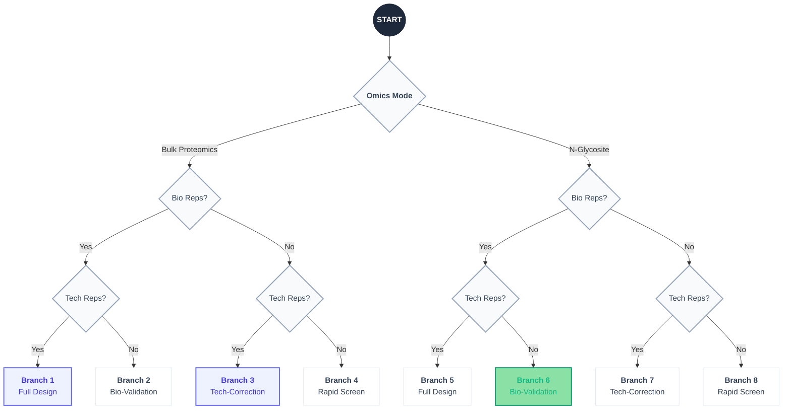
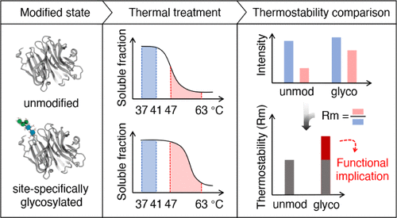

# Chat-RefinedTPP Platform
🤖 AI Agent–Driven Processing and Analysis Platform for Raw TMT-based Refined-TPP Quantitative Data

  
   
  

    <b>Next-Generation Refined-TPP quantitative data Preprocessing & QC & ΔRm Value Analysis Pipeline</b>
     
    <i>Empowering high-precision quantitative proteomics with robust AI-agent collaboration.</i>
  

  
  <b>Developer & Maintainer: Haoru Song (宋昊儒）</b>

  
  
  
  

---
## 📖 Introduction
**Chat-RefinedTPP** is an **AI-assisted analysis platform for [Refined-TPP](https://pubs.acs.org/doi/10.1021/jacs.5c08065) (*J. Am. Chem. Soc*. **2025**, *147*, 27, 24127–24139) experiments**, providing automated workflow selection, rigorous statistical analysis, and standardized processing for TMT-based datasets.

The platform integrates **intelligent experiment interpretation**, **robust statistical modeling**, and **specialized workflows for protein- and N-glycosite-level analyses**, enabling researchers to analyze Refined-TPP data with minimal manual configuration.

<strong>Simply input your raw DB-search results, and let the AI agent route your data through the optimal pipeline!!</strong>

---
## 🛠️ Key Features (Core Capabilities)
✨🤖 <strong>AI-Assisted Workflow Selection</strong>

*"Chat-RefinedTPP" features an intelligent agent that streamlines the transition from raw DB-search data to biological insights:*

- **1️⃣ Automated Interpretation**: Interprets complex experimental designs and determines replicate structures (Bio vs. Tech) without manual tagging.

- **2️⃣ Dynamic Routing**: Automatically selects the optimal processing pipeline from our 8-branch architecture.

- **3️⃣ Standardized Treatment**: Ensures that every dataset, regardless of its origin, undergoes a consistent and rigorous statistical treatment to eliminate human bias.
 

🛡️ <strong>Adaptive Statistical Framework</strong>

*Our platform implements a pipeline specifically engineered for thermal proteome profiling–derived stability metrics:*

- **1️⃣ Advanced Normalization**: Features Vehicle-anchored median normalization to eliminate systemic batch effects across TMT-plexes and conditions.

- **2️⃣ Multi-Level Modeling**: Includes replicate-level ΔRm calculation and ΔRm normality testing prior to final inference.

- **3️⃣ Variance Estimation**: Employs optional CV-guided binning statistics, enabling reliable differential analysis even in experiments without biological replicates (when ΔRm is normally distributed across proteins/N-glycosites).

- **4️⃣ FDR Control**: Integrated Benjamini–Hochberg (BH) correction to strictly maintain a low false discovery rate.
 

📈 <strong>Interactive Data Quality Control</strong>

*Bridging the gap between "black-box" analysis and researcher intuition:*

- **1️⃣ Visual Profiling**: Real-time Rm values' CV distribution visualization across all proteins/N-glycosites.

- **2️⃣ Interactive Thresholding**: Users can set custom CV cutoffs to automatically prune low-quality quantified proteins/N-glycosites.

- **3️⃣ Reliability Assurance**: Guarantees that downstream analysis is built upon ΔRm with high reproducibility and completeness.
 

🔍 <strong>Flexible Experimental Design Support</strong>

*Supporting multiple Refined-TPP experimental configurations, including experiments with or without biological replicates and technical replicates:*

- **1️⃣ Both protein-level and site-level proteomics datasets are supported**

- **2️⃣ Site Parsing**: Native extraction of N-glycosylation sites directly from database search result strings (e.g., [PEAKS ONLINE](https://www.bioinfor.com/peaks-online/)) combined with protein sequence .fasta files.

- **3️⃣ Site-level quantitative QC**: Tailored filtering and normalization optimized for the unique noise profiles of PTM datasets to ensure site-level precision.

---
## 🧭 Decision Matrix (8-Branch Architecture)
Our platform automatically routes your data through a **Triple-Layer Logic Gate**. Select your branch based on omics type and replicate design.

**Why we use 8-Branch Architexture?**

Unlike classical TPP based on melting-curve fitting such as [TPP-TR](https://www.science.org/doi/10.1126/science.1255784) (Mikhail M. Savitski et al. *Science* **2014**, *346*, 1255784), **Refined-TPP adopts a non-parametric analysis strategy** that does not require explicit melting-curve fitting. Instead, the method focuses on **ΔRm-based** stablity metrics, enabling robust comparision of protein stablity shifts between conditions **without assuming a predefined thermodynamic model** (such as 4PL-logistic in TPP-TR). 

  
  
  **Principle of Refined-TPP (*J. Am. Chem. Soc*. 2025)**

But on the other hand, the Refined-TPP framework avoids parametric curve fitting, in other words, the observed stability of proteins mainly relys on the **accuracy of sampling and data acquisition** with lower statistical power compared to parametric analysis, **technical replicates are recommended to partially smooth experiment noise and improve the reliability of ΔRm estimation**; as well, **biological replicates are recommend to verify the facticity of final results**. However, the optimal experiment design ultimately depends on:

- **Biological objective** of the study
- **Avaliable experiment budget**
- **Desired statistical rigor**

to accommodate these practical considerations, **Chat-RefinedTPP Platform supports multiple experimental configurations** built around the presence of:

- **Technical replicates**
- **Biological replicates**

These combinations naturally lead to the **8-branch analysis architecture illustrated above**, enabling researchers to select the appropriate workflow according to their experimental design.

Each branch is implemented as a standalone modular pipeline, invoked via its corresponding Python script as detailed below.
