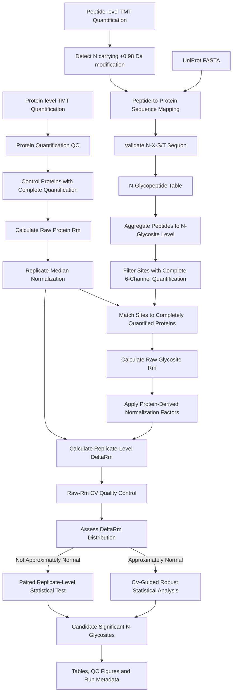
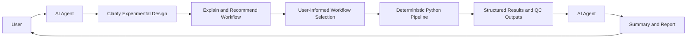

# 🧬 Branch 06 — G2: N-Glycosite-Level Analysis with Biological Replicates

> **Pipeline ID:** `Branch06_G2`  
> **Omics Mode:** N-glycosite-level proteomics  
> **Technical Replicates:** ❌ No  
> **Biological Replicates:** ✅ Yes  
> **Primary Stability Metric:** ΔRm  
> **Execution Mode:** Deterministic Python pipeline

---

## 📖 Overview

Branch 06 (G2) is designed for **N-glycosite-level Refined-TPP experiments containing biological replicates but no technical replicates**.

The pipeline integrates protein-level TMT quantification with N-glycopeptide-level measurements to estimate site-specific stability shifts while accounting for the corresponding protein-level Rm background.

The major analytical stages include:

1. Protein-level TMT quantification quality control
2. Control-proteome Rm calculation and replicate-median normalization
3. N-glycopeptide identification using peptide modification annotations and UniProt protein sequences
4. N-glycosite-level intensity aggregation
5. Quantification completeness filtering
6. Protein–glycosite matching
7. Raw-Rm coefficient-of-variation quality control
8. Replicate-level ΔRm calculation
9. ΔRm distribution assessment
10. Statistical identification of candidate stability-associated N-glycosites

> **Important:** All numerical processing, normalization, filtering, quality control, and statistical testing are performed by the deterministic Python pipeline. In the initial platform release, the AI agent acts as an interactive decision-support and workflow-navigation layer before analysis, and as a result-summary and report-generation layer after analysis.

---

## 🎯 When Is G2 Selected?

G2 is appropriate when the experimental design satisfies all of the following conditions:

| Criterion | Requirement |
|---|---|
| Analysis level | N-glycosite |
| Biological replicates | ✅ Present |
| Technical replicates | ❌ Absent |
| Protein-level reference quantification | ✅ Required |
| Peptide-level TMT quantification | ✅ Required |
| Protein sequence FASTA | ✅ Required |

In the web platform, the AI agent communicates with the user to clarify the experimental design and relevant analysis settings. Based on the information provided by the user, the agent explains the applicable workflow and recommends `Branch06_G2` when the dataset contains N-glycosite-level measurements with biological replicates but no technical replicates.

The agent supports scientific decision-making without replacing it. The user remains informed of the selected workflow and relevant analysis choices before the deterministic Python pipeline is executed.

For local execution, the G2 Python script can be run directly without the AI agent.

---

## 📥 Required Input Data

### 1. Protein-Level TMT Quantification Table

The protein-level table is used to:

- assess protein quantification completeness;
- identify the control/reference sample;
- calculate protein-level Rm values;
- estimate replicate-specific normalization factors;
- provide the protein-level reference for site-specific ΔRm calculation.

The pipeline expects TMT reporter-ion measurements corresponding to the six channels:

`126`, `127`, `128`, `129`, `130`, and `131`.

---

### 2. Peptide-Level TMT Quantification Table

The peptide-level table is used for:

- N-glycopeptide detection;
- peptide-to-protein mapping;
- site-level intensity aggregation;
- N-glycosite Rm calculation.

Peptide sequences should contain modification annotations from the database-search result.

---

### 3. UniProt Protein FASTA

A UniProt-compatible FASTA file is required to:

- normalize protein accession identifiers;
- map stripped peptide sequences back to proteins;
- determine absolute N-glycosite positions;
- validate the canonical N-glycosylation sequon;
- extract sequence motifs surrounding identified sites.

---

## 🔄 G2 Workflow Overview



---

# 🧪 Processing Details

## Step 1 — Protein Quantification QC

The protein-level TMT table is first inspected for reporter-ion quantification completeness.

Proteins may optionally be filtered according to the number of unique peptides supporting protein identification.

For each biological sample, proteins with non-zero TMT reporter intensities are summarized. Depending on the number of samples, quantified-protein overlap can be visualized using either:

- Venn diagrams; or
- UpSet plots.

For downstream Rm analysis, the pipeline retains proteins with complete reporter-ion quantification in all required TMT channels.

---

## Step 2 — Protein-Level Rm Calculation

For each completely quantified control protein, three replicate-level Rm values are calculated:

\[
Rm_1 = \frac{I_{129}}{I_{127}}
\]

\[
Rm_2 = \frac{I_{130}}{I_{128}}
\]

\[
Rm_3 = \frac{I_{131}}{I_{126}}
\]

where \(I_x\) represents the reporter-ion intensity of TMT channel \(x\).

Each Rm corresponds to one biological replicate.

---

## Step 3 — Replicate-Median Rm Normalization

Systematic differences among biological replicates are corrected using **multiplicative replicate-median normalization**.

For each replicate:

\[
M_i = median(Rm_i)
\]

where \(M_i\) is the median Rm across all completely quantified control proteins in replicate \(i\).

A common reference center is defined as:

\[
M_{ref}
=
\exp
\left[
median
\left(
\log M_1,
\log M_2,
\log M_3
\right)
\right]
\]

The correction factor for replicate \(i\) is:

\[
CF_i = \frac{M_{ref}}{M_i}
\]

Normalized protein Rm values are then calculated as:

\[
Rm_{protein,i}^{norm}
=
Rm_{protein,i}^{raw}
\times CF_i
\]

The same replicate-specific correction factors are subsequently applied to N-glycosite Rm values, ensuring that protein-level and site-level measurements remain on the same normalized scale.

---

## Step 4 — N-Glycopeptide Identification

Candidate N-glycopeptides are identified by searching for **asparagine residues carrying a +0.98 Da modification**.

The implementation does not require `+0.98` to be the only modification associated with the residue. An N residue may contain additional modification annotations as long as a mass shift compatible with `+0.98 Da` is present.

After modification parsing:

1. modification annotations are removed to obtain the stripped peptide sequence;
2. the peptide is mapped to its corresponding UniProt protein sequence;
3. the absolute position of the modified N residue is determined;
4. the surrounding sequence is inspected for the canonical N-glycosylation sequon:

\[
N-X-S/T
\]

where:

\[
X \neq P
\]

Only modified N residues satisfying the sequon requirement are retained as candidate N-glycosylation sites.

---

## Step 5 — Peptide-to-Site Aggregation

Multiple quantified peptides may represent the same N-glycosylation site.

The G2 pipeline therefore converts peptide-level measurements into a site-centric representation.

For each unique combination of:

`Protein Accession + N-Glycosite`

the intensities of all peptides supporting that site are summed independently for each TMT channel.

The resulting table contains one row for each unique N-glycosite.

A user-defined sequence window can additionally be extracted around each site from the UniProt sequence for motif annotation.

---

## Step 6 — Complete Site Quantification Filtering

Only N-glycosites with complete quantification across all six required TMT reporter channels are retained for downstream Rm analysis.

Zero reporter intensity is treated as missing quantification during this completeness filter.

The retained site table therefore represents N-glycosites with sufficient quantitative information to calculate all three biological-replicate Rm values.

---

## Step 7 — Protein–Glycosite Matching

Calculation of site-specific ΔRm requires both:

- a completely quantified N-glycosite; and
- a completely quantified protein-level reference for the corresponding protein.

The pipeline therefore intersects:

1. proteins with complete control-proteome quantification; and
2. proteins containing completely quantified N-glycosites.

Only matched protein–site pairs proceed to ΔRm analysis.

---

## Step 8 — N-Glycosite Rm Calculation

For each retained N-glycosite:

\[
Rm_{glyco,1}^{raw}
=
\frac{I_{129}}{I_{127}}
\]

\[
Rm_{glyco,2}^{raw}
=
\frac{I_{130}}{I_{128}}
\]

\[
Rm_{glyco,3}^{raw}
=
\frac{I_{131}}{I_{126}}
\]

The replicate-specific correction factors obtained from the control proteome are then applied:

\[
Rm_{glyco,i}^{norm}
=
Rm_{glyco,i}^{raw}
\times CF_i
\]

Importantly, normalization factors are estimated from the protein-level control dataset and are **not independently estimated from the glycosite dataset**.

---

# 🛡️ Raw-Rm CV Quality Control

## Step 9 — Protein and Glycosite CV Calculation

Coefficient of variation is calculated using **raw, non-normalized Rm values**.

For each protein:

\[
CV_{protein}
=
\frac{
SD(Rm_{protein,1}^{raw},
Rm_{protein,2}^{raw},
Rm_{protein,3}^{raw})
}{
Mean(Rm_{protein,1}^{raw},
Rm_{protein,2}^{raw},
Rm_{protein,3}^{raw})
}
\]

For each N-glycosite:

\[
CV_{glycosite}
=
\frac{
SD(Rm_{glyco,1}^{raw},
Rm_{glyco,2}^{raw},
Rm_{glyco,3}^{raw})
}{
Mean(Rm_{glyco,1}^{raw},
Rm_{glyco,2}^{raw},
Rm_{glyco,3}^{raw})
}
\]

A user-defined CV threshold is applied jointly.

A site proceeds to differential analysis only when:

\[
CV_{protein} \leq CV_{threshold}
\]

and

\[
CV_{glycosite} \leq CV_{threshold}
\]

This ensures that downstream ΔRm inference is based on reproducible protein-level and site-level measurements.

---

# 📐 ΔRm Calculation

## Step 10 — Replicate-Level ΔRm

For each biological replicate:

\[
\Delta Rm_i
=
Rm_{glyco,i}^{norm}
-
Rm_{protein,i}^{norm}
\]

Thus:

\[
\Delta Rm_1,\quad
\Delta Rm_2,\quad
\Delta Rm_3
\]

represent the site-specific stability shift relative to the corresponding protein-level reference in each biological replicate.

The final effect-size estimate is:

\[
\Delta Rm_{mean}
=
Mean(
\Delta Rm_1,
\Delta Rm_2,
\Delta Rm_3
)
\]

The default positive effect-size criterion is:

\[
\Delta Rm_{mean} > 0.1
\]

> **Important:** The `0.1` threshold is applied to the **mean ΔRm across biological replicates**, rather than requiring every individual replicate to have `ΔRm > 0.1`.

Replicate-level ΔRm values remain available for quality assessment and statistical analysis.

---

# 📊 Statistical Analysis

## Step 11 — ΔRm Distribution Assessment

Following CV filtering, the distribution of ΔRm is evaluated independently for each biological replicate.

Diagnostic outputs include:

- histogram and kernel density estimation;
- Q-Q plot;
- P-P plot;
- sample-size-adaptive normality assessment.

The statistical branch used for downstream inference depends on the resulting distributional assessment.

---

## Route A — Approximately Normal ΔRm Distribution

When all replicate-level ΔRm distributions are considered approximately normal, G2 uses a **CV-guided binning strategy**.

Sites are ordered using a representative CV measure derived from protein-level and glycosite-level variability.

Within CV-matched bins, replicate-specific one-tailed significance values are estimated using a robust median-centered variance model.

Statistical inference is performed independently for each biological replicate before replicate-level evidence is combined.

The current implementation can retain a positive-direction consistency requirement across biological replicates.

The biological effect-size criterion remains:

\[
\Delta Rm_{mean} > 0.1
\]

and is not replaced by replicate-specific `ΔRm > 0.1` thresholds.

---

## Route B — Non-Normal ΔRm Distribution

If at least one replicate-level ΔRm distribution does not satisfy the normality criterion, site-level paired testing is used.

For each N-glycosite, normalized protein and glycosite Rm values are paired by biological replicate:

| Biological Replicate | Protein Reference | N-Glycosite |
|---|---|---|
| Replicate 1 | \(Rm_{protein,1}^{norm}\) | \(Rm_{glyco,1}^{norm}\) |
| Replicate 2 | \(Rm_{protein,2}^{norm}\) | \(Rm_{glyco,2}^{norm}\) |
| Replicate 3 | \(Rm_{protein,3}^{norm}\) | \(Rm_{glyco,3}^{norm}\) |

The default non-parametric option is the **one-tailed Wilcoxon signed-rank test**.

A paired t-test can optionally be selected when appropriate.

For the positive-stability direction, the alternative hypothesis is:

\[
Rm_{glycosite}^{norm}
>
Rm_{protein}^{norm}
\]

Because the paired differences are equivalent to replicate-level ΔRm values, the test evaluates whether the glycosite exhibits a positive stability shift relative to its protein-level reference.

---

## 🧮 Multiple-Testing Correction

Benjamini–Hochberg multiple-testing correction is available as an optional analysis setting.

### BH enabled

The adjusted significance metric is:

`FDR_BH`

### BH disabled

The unadjusted significance metric is:

`p_value`

The output explicitly records whether BH correction was applied so that raw p-values are not mislabeled as FDR values.

---

# 📈 Quality-Control and Diagnostic Outputs

The G2 pipeline generates multiple QC visualizations, including:

- quantified-protein overlap plots;
- N-glycopeptide intensity composition;
- N-glycosite-count distribution per protein;
- protein Rm CV distribution;
- N-glycosite Rm CV distribution;
- protein-CV versus glycosite-CV scatter plot;
- replicate-level ΔRm histograms;
- Q-Q plots;
- P-P plots;
- significance-versus-binning diagnostics where applicable;
- volcano-like significance plots;
- paired protein-versus-glycosite Rm visualizations where applicable.

These figures are intended for analytical inspection and should be interpreted together with the exported quantitative tables.

---

# 📤 Output Structure

The standardized local G2 implementation organizes output into:

```text
Branch06_G2_output/
├── tables/
│   ├── protein quantification QC
│   ├── Rm normalization factors
│   ├── N-glycopeptide table
│   ├── N-glycosite intensity table
│   ├── complete-quantification sites
│   ├── protein/site Rm summaries
│   ├── ΔRm table
│   ├── CV-QC-passed sites
│   └── statistical results
│
├── figures/
│   └── QC and statistical visualizations
│
├── metadata/
│   └── run_parameters.json
│
└── intermediate/
    └── intermediate processing files
```

The metadata file records the analytical settings used for the run and improves reproducibility.

It is generated automatically by the local pipeline and does **not** require the user to provide JSON-formatted input.

---

# 🤖 Role of the AI Agent in Release v1

The AI agent is intentionally separated from the numerical analysis pipeline.

Its role is to **support scientific decision-making without replacing it**.

In Release v1, the agent participates at two stages.

## Before Analysis — Interactive Decision Support and Workflow Routing

The agent communicates with the user to clarify the experimental design and any information required for workflow selection.

Typical clarification includes:

- whether the analysis is protein-level or N-glycosite-level;
- whether biological replicates are present;
- whether technical replicates are present;
- whether the required protein-, peptide-, and sequence-level inputs are available;
- whether an experimental-design description is ambiguous and requires further clarification.

Based on the information provided by the user, the agent:

- explains which pipeline branches are applicable;
- describes why a particular branch is recommended;
- highlights relevant analytical implications where necessary;
- prompts the user when important information is missing;
- routes the analysis to the appropriate deterministic Python pipeline after the workflow is sufficiently clarified.

The agent does **not** silently infer experimental-design details that materially affect branch selection.

---

## After Analysis — Result Interpretation and Reporting

After the deterministic Python pipeline has completed, the agent can use the generated:

- quantitative result tables;
- QC statistics;
- statistical results;
- figures;
- run metadata;

to summarize the analysis and generate a structured, human-readable report.

The report may include:

- a concise description of the workflow used;
- a summary of data-retention and QC results;
- major ΔRm and statistical findings;
- notable QC limitations or warnings;
- a structured interpretation of pipeline-generated results.

---

## The Agent Does Not

In Release v1, the AI agent does **not**:

- replace the deterministic numerical pipeline;
- redefine the mathematical definition of Rm or ΔRm;
- independently rewrite the statistical workflow;
- silently change CV or significance thresholds;
- override user-confirmed analytical choices;
- independently declare sites significant outside the pipeline-defined result;
- modify statistical results after pipeline execution.

This separation preserves reproducibility while allowing the agent to improve workflow accessibility, experimental-design clarification, and result communication.

A simplified Release v1 architecture is:



---

# 💻 Local Execution

G2 can be executed independently of the web platform.

```bash
python Branch06_G2.py
```

The local version interactively requests required file paths and analytical parameters.

No AI agent or JSON-formatted user input is required for standalone execution.

---

# ⚠️ Analytical Notes

1. G2 assumes that biological-replicate channel pairing is correctly defined by the experimental TMT design.
2. Protein-level and N-glycosite-level Rm values must use the same replicate structure.
3. The same protein-derived normalization factors are applied to corresponding N-glycosite Rm values.
4. CV quality control is calculated from raw Rm values.
5. The default ΔRm effect-size threshold is applied to mean ΔRm across biological replicates.
6. Multiple-testing correction should be reported explicitly as enabled or disabled.
7. With a small number of biological replicates, statistical power and p-value resolution may be limited; significance results should therefore be interpreted together with effect size, replicate consistency, and QC metrics.
8. Agent-generated summaries should reflect the deterministic pipeline outputs and should not be interpreted as independent statistical re-analysis.

---

## 🔗 Related Documentation

- [Main Project README](../README.md)
- [Branch 05 — G1](./Branch05_G1.md)
- [Branch 07 — G3](./Branch07_G3.md)
- [Branch 08 — G4](./Branch08_G4.md)

---

## 📌 Pipeline Summary

| Feature | G2 Implementation |
|---|---|
| Omics type | N-glycosite-level |
| Technical replicates | No |
| Biological replicates | Yes |
| Protein reference required | Yes |
| N-glycosite detection | +0.98 Da modified N + sequence validation |
| Glycosylation motif | N-X-S/T, X ≠ P |
| Protein/site normalization | Shared replicate-median correction factors |
| CV basis | Raw Rm |
| Site effect size | Mean ΔRm |
| Default ΔRm cutoff | > 0.1 |
| Distribution assessment | Replicate-level |
| Normal route | CV-guided robust analysis |
| Non-normal route | Paired Wilcoxon / optional paired t-test |
| BH correction | Optional |
| AI role | Interactive decision support + workflow routing + post-analysis reporting |
| Local standalone execution | Supported |
