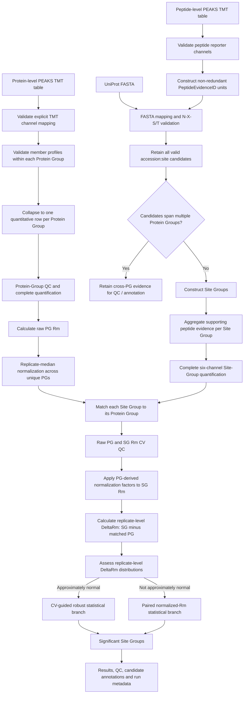
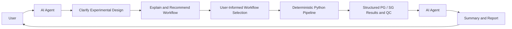

# 🧬 Branch 06 — G2: N-Glycosite-Level Analysis with Biological Replicates

> **Pipeline ID:** `Branch06_G2`
> **Omics Mode:** N-glycosite-level proteomics
> **Technical Replicates:** ❌ No
> **Biological Replicates:** ✅ Yes
> **Primary Stability Metric:** ΔRm
> **Protein Quantitative Unit:** PEAKS Protein Group
> **Site Quantitative / Statistical Unit:** Site Group
> **Execution Mode:** Deterministic Python pipeline

---

## 📖 Overview

Branch 06 (G2) is designed for **N-glycosite-level Refined-TPP experiments containing biological replicates but no technical replicates**.

The standardized G2 workflow separates three concepts that can be conflated in accession-expanded proteomics tables:

1. **quantitative evidence** — the non-redundant TMT signal actually measured;
2. **quantitative/statistical units** — Protein Groups at protein level and Site Groups at site level;
3. **biological annotations** — UniProt accessions and accession-specific candidate N-glycosites compatible with the quantitative evidence.

The guiding principle is:

> **Quantification is performed at the level of non-redundant quantitative evidence, whereas all compatible protein and site assignments are retained as biological annotations.**

Therefore, repeated accession assignments of the same PEAKS quantitative profile do not automatically multiply quantitative weight. Likewise, one shared N-glycopeptide can retain several candidate accession:site annotations without automatically creating several independent statistical tests.

The major analytical stages include:

1. Protein-group TMT quantification quality control
2. Control Protein-Group Rm calculation and replicate-median normalization
3. Non-redundant peptide quantitative-evidence construction
4. N-glycopeptide detection and UniProt sequence mapping
5. Candidate site-assignment construction
6. Site-Group aggregation
7. Quantification completeness filtering
8. Protein-Group / Site-Group raw-Rm CV quality control
9. Replicate-level Site-Group ΔRm calculation
10. ΔRm distribution assessment and statistical testing
11. Structured QC, result, provenance, and metadata output

> **Important:** All numerical processing, normalization, filtering, quality control, and statistical testing are performed by the deterministic Python pipeline. The AI agent supports scientific decision-making without replacing it.

---

## 🎯 When Is G2 Selected?

G2 is appropriate when the experimental design satisfies all of the following conditions:

| Criterion | Requirement |
|---|---|
| Analysis level | N-glycosite |
| Biological replicates | ✅ Present |
| Technical replicates | ❌ Absent |
| Protein-level TMT reference | ✅ Required |
| Peptide-level TMT quantification | ✅ Required |
| Protein sequence FASTA | ✅ Required |

In the web platform, the AI agent communicates with the user to clarify the experimental design and relevant analysis settings. Based on the user-provided information, the agent explains applicable workflows and recommends `Branch06_G2` when the dataset contains N-glycosite-level measurements with biological replicates but no technical replicates.

The user remains informed of workflow selection and relevant analysis choices before the deterministic Python pipeline is executed.

For local execution, G2 can be run directly without an AI agent or required JSON input.

---

# 🧩 Quantitative Units and Biological Annotation

## Protein Group (PG)

A **Protein Group** is the protein-level quantitative unit.

Within a PEAKS Protein Group, member accessions can represent different biological proteins or isoforms, but PEAKS may report the same quantitative TMT profile for those member rows because the available peptide evidence does not distinguish them quantitatively.

Accordingly:

- each unique Protein Group contributes **one protein-level quantitative profile**;
- each unique Protein Group contributes **one weight** to Rm normalization;
- member accessions are retained as biological and sequence identities;
- the pipeline validates that accession rows assigned to the same Protein Group have consistent reporter-ion profiles before collapsing them to one quantitative row.

Thus:

```text
Protein Group 930
├── P36507
└── Q02750
```

is represented quantitatively as one PG, while both accessions remain available for sequence mapping and annotation.

---

## Peptide Quantitative Evidence

PEAKS peptide exports can contain the same quantitative peptide signal repeated across compatible accessions.

The standardized G2 workflow therefore constructs a non-redundant **peptide quantitative-evidence unit** before site-level analysis.

Conceptually:

```text
PEAKS accession-expanded rows
        ↓
collapse duplicate representation of the same quantitative evidence
        ↓
PeptideEvidenceID
```

A repeated accession assignment does not cause the same reporter-ion profile to be counted multiple times.

All compatible accessions are nevertheless retained for downstream FASTA mapping and candidate-site annotation.

---

## Site Group (SG)

A **Site Group** is the site-level quantitative and statistical unit.

A Site Group is defined by:

- one uniquely defined Protein Group; and
- one candidate accession:site assignment set supported by one or more peptide quantitative-evidence units.

A Site Group can therefore contain:

- one uniquely assigned candidate site; or
- multiple candidate accession-specific sites that remain ambiguous within the same Protein Group.

Example:

```text
SiteGroupID = SG000001
ProteinGroup = 930
CandidateSites = P36507:N123;Q02750:N118
MappingStatus = ambiguous_within_protein_group
```

This represents:

- **one site-level quantitative profile**;
- **one statistical hypothesis**;
- **two retained biological candidate-site annotations**.

Candidate annotations do not multiply quantitative weight or the number of statistical tests.

---

## Cross-Protein-Group Ambiguity

If one peptide quantitative evidence is compatible with candidate sites from more than one Protein Group, the matched protein-level reference is not unique.

For example:

```text
shared evidence
├── PG930  / P36507:N123
└── PG1200 / QXXXXX:N118
```

Because the canonical ΔRm definition requires a unique matched Protein Group, such evidence is:

- retained in peptide-level mapping/QC output;
- annotated as `ambiguous_across_protein_groups`;
- excluded from canonical Site-Group ΔRm analysis.

The pipeline does not silently choose one Protein Group reference.

---

## 📥 Required Input Data

### 1. Protein-Level TMT Quantification Table

The protein-level table is used to:

- identify PEAKS Protein Groups and member accessions;
- assess protein-group quantification completeness;
- identify the control/reference sample;
- calculate Protein-Group Rm values;
- estimate replicate-specific normalization factors;
- provide the matched Protein-Group reference for Site-Group ΔRm.

The pipeline expects reporter-ion measurements for the six channels:

`126`, `127`, `128`, `129`, `130`, and `131`.

Reporter channels are mapped by **channel identity encoded in the column name**, not by dataframe column order.

Each detected sample must contain exactly one reporter column for each required channel. Missing or duplicated channels cause an explicit error.

### 2. Peptide-Level TMT Quantification Table

The peptide table is used for:

- non-redundant peptide quantitative-evidence construction;
- N-glycopeptide detection;
- accession-aware peptide-to-protein mapping;
- candidate-site assignment;
- Site-Group intensity aggregation.

Required biological identity fields include PEAKS Protein Group, accession, and peptide sequence. Reporter-channel completeness is validated explicitly.

### 3. UniProt Protein FASTA

A UniProt-compatible FASTA file is required to:

- normalize accession identifiers;
- map stripped peptide sequences to candidate proteins;
- determine absolute N-glycosite positions;
- validate the canonical N-glycosylation sequon;
- extract sequence motifs around candidate sites.

---

## 🔄 G2 Workflow Overview



---

# 🧪 Processing Details

## Step 1 — Protein Quantification QC and Protein-Group Construction

The protein-level TMT table is first validated for:

- a detectable Protein Group column;
- a detectable accession column;
- explicit sample identities;
- exactly one TMT reporter column for each of channels 126–131 per sample.

The workflow does **not** infer reporter-channel identity from column position. If sample/channel mapping cannot be inferred safely from the column names, execution stops instead of guessing positional blocks.

Protein rows can optionally be filtered according to a user-defined minimum number of unique peptides.

After filtering, rows belonging to the same Protein Group are checked for reporter-profile consistency. A Protein Group can be collapsed to one quantitative row only when its member rows have the same quantitative reporter profile within numerical tolerance.

The output distinguishes:

- Protein Group count;
- member accession count;
- complete-quantification Protein Group count.

Normalization and protein-level CV analysis operate on **unique Protein Groups**, not accession-expanded rows.

---

## Step 2 — Protein-Group Rm Calculation

For Protein Group $g$ and TMT channel $c$, let $I^{PG}_{g,c}$ denote Protein-Group reporter intensity.

Three biological-replicate Rm values are calculated:

```math
\begin{aligned}
Rm^{PG}_{g,1} &= \frac{I^{PG}_{g,129}}{I^{PG}_{g,127}}, \\
Rm^{PG}_{g,2} &= \frac{I^{PG}_{g,130}}{I^{PG}_{g,128}}, \\
Rm^{PG}_{g,3} &= \frac{I^{PG}_{g,131}}{I^{PG}_{g,126}}.
\end{aligned}
```

Each Rm corresponds to one biological replicate.

---

## Step 3 — Replicate-Median Rm Normalization

Systematic differences among biological replicates are corrected using **multiplicative replicate-median normalization**.

For replicate $i$, the normalization population consists of unique control Protein Groups passing the relevant QC filters:

```math
M_i = \operatorname{median}_{g}\left(Rm^{PG}_{g,i}\right)
```

The common reference center is:

```math
T = \exp\left[\operatorname{median}_{i}\left(\log M_i\right)\right]
```

The replicate-specific correction factor is:

```math
CF_i = \frac{T}{M_i}
```

Normalized Protein-Group Rm is:

```math
Rm^{PG,\mathrm{norm}}_{g,i} = Rm^{PG}_{g,i}\times CF_i
```

The same correction factors are subsequently applied to Site-Group Rm values.

> **Important:** Each unique Protein Group has one normalization weight. A Protein Group containing multiple member accessions does not receive additional weight merely because its quantitative profile is repeated across accession rows.

---

## Step 4 — Non-Redundant Peptide Quantitative Evidence

Before N-glycosite mapping, accession-expanded peptide rows representing the same quantitative peptide evidence are collapsed.

Each non-redundant observation receives a `PeptideEvidenceID`.

The pipeline retains:

- modified peptide sequence;
- stripped peptide sequence after parsing;
- Protein Group relationship;
- all candidate accessions;
- one reporter-ion profile;
- optional localization metrics such as AScore when available.

If duplicate representations expected to describe one quantitative evidence record contain inconsistent reporter-ion profiles, the pipeline does not silently merge them.

---

## Step 5 — N-Glycopeptide Identification and Candidate-Site Mapping

Candidate N-glycopeptides are identified by searching for **asparagine residues carrying a mass shift compatible with +0.98 Da**.

The parser allows other modifications to occur on the same N residue. For example, an N residue containing both `+42.01` and `+0.98` can still be recognized if the +0.98-like modification is attached to that N.

Malformed modification annotations such as unmatched parentheses cause an explicit parsing error rather than an infinite loop or silent truncation.

For each peptide quantitative evidence:

1. modification annotations are parsed to obtain the stripped peptide sequence;
2. all candidate accessions are mapped to UniProt sequences;
3. the absolute position of each modified N is determined;
4. the canonical sequon $N-X-S/T$, where $X \neq P$, is validated;
5. all valid accession:site candidates are retained.

The resulting mapping can be:

- `unique` — one candidate site;
- `ambiguous_within_protein_group` — multiple candidate sites within one PG;
- `ambiguous_across_protein_groups` — candidate sites spanning multiple PGs.

---

## Step 6 — Site-Group Construction and Peptide Aggregation

For a peptide evidence $e$, let $C_e$ denote its candidate accession:site assignment set.

Peptide evidences are aggregated into the same Site Group when they share:

- the same Protein Group; and
- the same candidate-site assignment set.

Thus, if:

```math
C_{e_1}=C_{e_2}
```

within the same Protein Group, the evidences can support one Site Group.

If candidate sets overlap but are not identical, the workflow does not automatically propagate or resolve the ambiguity.

For example:

```text
Peptide A → {P36507:N123}
Peptide B → {P36507:N123, Q02750:N118}
```

are retained as different Site Groups because assigning peptide B to the unique site would require an additional site-inference assumption.

For Site Group $s$, let $E_s$ be the set of supporting peptide quantitative-evidence units. Reporter intensity is summed once per evidence:

```math
I^{SG}_{s,c}
=
\sum_{e\in E_s} I_{e,c}
```

A repeated accession annotation of the same peptide evidence does not duplicate its intensity contribution.

---

## Step 7 — Complete Site-Group Quantification Filtering

Only Site Groups with complete quantification across all six required reporter channels for the selected glycosite sample group are retained for downstream Rm analysis.

Zero reporter intensity is treated as missing for this completeness filter.

QC reporting distinguishes:

- total Site Groups;
- uniquely assigned Site Groups;
- ambiguous-within-PG Site Groups;
- candidate site annotations;
- cross-PG ambiguous evidence retained outside canonical ΔRm analysis.

---

## Step 8 — Site-Group Rm Calculation and Protein-Group Matching

For Site Group $s$:

```math
Rm^{SG}_{s,1}
=
\frac{I^{SG}_{s,129}}{I^{SG}_{s,127}}
```

```math
Rm^{SG}_{s,2}
=
\frac{I^{SG}_{s,130}}{I^{SG}_{s,128}}
```

```math
Rm^{SG}_{s,3}
=
\frac{I^{SG}_{s,131}}{I^{SG}_{s,126}}
```

The Protein-Group-derived correction factors are applied:

```math
Rm^{SG,\mathrm{norm}}_{s,i}
=
Rm^{SG}_{s,i}\times CF_i
```

Each Site Group entering canonical G2 analysis must map to one unique matched Protein Group $g(s)$.

The correction factors are estimated only from the control Protein-Group population and are **not independently estimated from Site Groups**.

---

# 🛡️ Raw-Rm CV Quality Control

## Step 9 — Protein-Group and Site-Group CV

Coefficient of variation is calculated from **raw, non-normalized Rm values**.

For Protein Group $g$:

```math
CV^{PG}_{g}
=
\frac{
\operatorname{SD}_{i}
\left(Rm^{PG}_{g,i}\right)
}{
\operatorname{Mean}_{i}
\left(Rm^{PG}_{g,i}\right)
}
```

For Site Group $s$:

```math
CV^{SG}_{s}
=
\frac{
\operatorname{SD}_{i}
\left(Rm^{SG}_{s,i}\right)
}{
\operatorname{Mean}_{i}
\left(Rm^{SG}_{s,i}\right)
}
```

A user-defined CV threshold is applied jointly. A Site Group proceeds only when:

```math
CV^{PG}_{g(s)}\leq CV_{\mathrm{threshold}}
```

and

```math
CV^{SG}_{s}\leq CV_{\mathrm{threshold}}
```

> **Important:** CV is calculated before replicate-median normalization. Normalized Rm values are used for ΔRm and paired statistical comparison.

---

# 📐 ΔRm Calculation

## Step 10 — Replicate-Level Site-Group ΔRm

For Site Group $s$ with unique matched Protein Group $g(s)$:

```math
\boxed{
\Delta Rm_{s,i}
=
Rm^{SG,\mathrm{norm}}_{s,i}
-
Rm^{PG,\mathrm{norm}}_{g(s),i}
}
```

Thus, each replicate-level ΔRm represents the Site-Group stability shift relative to the matched Protein-Group reference in the same biological replicate.

The final Site-Group effect size is the arithmetic mean:

```math
\boxed{
\overline{\Delta Rm}_{s}
=
\frac{1}{3}
\sum_{i=1}^{3}\Delta Rm_{s,i}
}
```

The default positive effect-size criterion is:

```math
\boxed{
\overline{\Delta Rm}_{s}>0.1
}
```

> **Important:** The `0.1` threshold is applied to the **mean ΔRm across biological replicates**. Individual replicate ΔRm values are not independently required to exceed `0.1`.

The current normal-branch implementation can additionally require all replicate-level ΔRm values to remain in the positive direction. This direction-consistency rule is distinct from the mean effect-size threshold.

---

# 📊 Statistical Analysis

## Step 11 — ΔRm Distribution Assessment

Following joint PG/SG CV filtering, the distribution of replicate-level ΔRm is evaluated independently for each biological replicate.

Diagnostic outputs include:

- histogram and kernel density estimation;
- Q-Q plot;
- P-P plot;
- sample-size-adaptive normality assessment.

The downstream statistical route depends on this distributional assessment.

---

## Route A — Approximately Normal ΔRm Distribution

When all replicate-level ΔRm distributions are considered approximately normal, G2 uses a **CV-guided binning strategy**.

Site Groups are ordered using a representative CV measure derived from Protein-Group and Site-Group variability.

Within CV-matched bins, replicate-specific one-tailed significance values are estimated using a robust median-centered variance model.

Statistical inference is performed separately for each biological replicate before replicate-level evidence is combined.

The current consensus rule can require:

- all replicate ΔRm values to have positive direction;
- mean ΔRm to exceed the configured threshold;
- all replicate significance values to be below 0.10;
- at least one replicate significance value to be below 0.05.

The effect-size criterion remains:

```math
\overline{\Delta Rm}_{s}>0.1
```

and is not replaced by replicate-specific `ΔRm > 0.1` thresholds.

The binning helper prevents zero-width bins when the requested bin count exceeds the number of available Site Groups.

---

## Route B — Non-Normal ΔRm Distribution

If at least one replicate-level ΔRm distribution does not satisfy the normality criterion, Site-Group-level paired testing is used.

For Site Group $s$, normalized Protein-Group and Site-Group Rm values are paired by biological replicate:

| Biological replicate | Matched Protein Group | Site Group |
|---|---|---|
| Replicate 1 | $Rm^{PG,\mathrm{norm}}_{g(s),1}$ | $Rm^{SG,\mathrm{norm}}_{s,1}$ |
| Replicate 2 | $Rm^{PG,\mathrm{norm}}_{g(s),2}$ | $Rm^{SG,\mathrm{norm}}_{s,2}$ |
| Replicate 3 | $Rm^{PG,\mathrm{norm}}_{g(s),3}$ | $Rm^{SG,\mathrm{norm}}_{s,3}$ |

The default non-parametric option is the **one-tailed paired Wilcoxon signed-rank test**.

A paired t-test can optionally be selected.

For the positive-stability direction, the alternative hypothesis is:

```math
Rm^{SG,\mathrm{norm}}_{s}
>
Rm^{PG,\mathrm{norm}}_{g(s)}
```

Because paired differences equal replicate-level ΔRm:

```math
Rm^{SG,\mathrm{norm}}_{s,i}
-
Rm^{PG,\mathrm{norm}}_{g(s),i}
=
\Delta Rm_{s,i}
```

the paired test evaluates whether the Site Group exhibits a positive stability shift relative to its matched Protein Group.

With only three biological pairs, Wilcoxon p-value resolution is intrinsically limited. The pipeline reports this limitation when relevant, particularly when BH correction can make a nominal FDR threshold unattainable.

---

## 🧮 Multiple-Testing Correction

Benjamini–Hochberg multiple-testing correction is user-selectable.

### BH enabled

The adjusted significance metric is:

`FDR_BH`

### BH disabled

The unadjusted significance metric is:

`p_value`

Raw p-values are never relabeled as FDR values.

### Statistical unit

One hypothesis corresponds to one **SiteGroupID**.

If a Site Group has multiple candidate annotations, for example:

```text
SG000001
├── P36507:N123
└── Q02750:N118
```

it still contributes one statistical hypothesis.

Therefore, candidate annotation expansion does not change the BH hypothesis count.

---

# 📈 Quality-Control and Diagnostic Outputs

G2 reports both quantitative-unit counts and biological annotation counts so that accession expansion is not confused with additional independent quantitative information.

Recommended QC quantities include:

- raw protein-table row count;
- unique Protein Group count;
- member accession count;
- completely quantified Protein Group count;
- raw peptide-table row count;
- unique peptide quantitative-evidence count;
- valid N-glycopeptide evidence count;
- uniquely mapped peptide-evidence count;
- ambiguous-within-PG peptide-evidence count;
- ambiguous-across-PG peptide-evidence count;
- total Site Group count;
- unique Site Group count;
- ambiguous-within-PG Site Group count;
- candidate accession:site annotation count;
- completely quantified Site Group count;
- Site Groups matched to a complete Protein-Group reference;
- Site Groups passing joint raw-Rm CV QC;
- Site Groups entering statistical analysis;
- significant Site Group count.

The pipeline also generates visual QC outputs such as:

- Protein-Group quantification overlap plots;
- non-redundant N-glycopeptide intensity composition;
- Site-Group count distribution per Protein Group;
- Protein-Group raw-Rm CV distribution;
- Site-Group raw-Rm CV distribution;
- Protein-Group CV versus Site-Group CV scatter plot;
- replicate-level ΔRm histograms;
- Q-Q plots;
- P-P plots;
- significance-versus-binning diagnostics where applicable;
- volcano-like significance plots;
- paired Protein-Group-versus-Site-Group normalized Rm visualizations where applicable.

A count of candidate sites should not be interpreted as the number of independent quantitative Site Groups unless all Site Groups are uniquely assigned.

---

# 📤 Output Structure

The standardized local G2 implementation organizes output into:

```text
Branch06_G2_output/
├── tables/
│   ├── Protein-Group quantification QC
│   ├── Rm normalization factors
│   ├── non-redundant N-glycopeptide evidence
│   ├── Site-Group intensity and annotation tables
│   ├── complete-quantification Site Groups
│   ├── Protein-Group / Site-Group Rm summaries
│   ├── Site-Group ΔRm table
│   ├── CV-QC-passed Site Groups
│   └── statistical results
│
├── figures/
│   └── QC and statistical visualizations
│
├── metadata/
│   └── run_parameters.json
│
└── intermediate/
    └── intermediate processing files
```

The metadata file records method semantics as well as run-specific parameters, including:

- `protein_quantitative_unit = PEAKS_Protein_Group`;
- `protein_member_identity_unit = UniProt_accession`;
- Site-Group definition;
- shared-peptide policy;
- candidate-annotation policy;
- one-vote-per-Protein-Group normalization weighting;
- SiteGroupID as the multiple-testing unit;
- Rm, normalization, CV, and ΔRm formula definitions;
- CV threshold;
- ΔRm threshold;
- BH enabled/disabled state;
- normality settings and statistical-route information.

The metadata is generated automatically by local execution and does **not** require JSON-formatted user input.

---

# 🧾 Key Machine-Readable Output Semantics

Protein-level derived fields use explicit Protein-Group naming, for example:

```text
protein_group_rm_rep1_raw
protein_group_rm_rep2_raw
protein_group_rm_rep3_raw
protein_group_rm_rep1_norm
protein_group_rm_rep2_norm
protein_group_rm_rep3_norm
protein_group_rm_norm_mean
protein_group_rm_raw_cv
```

Site-level derived fields use explicit Site-Group naming:

```text
site_group_rm_rep1_raw
site_group_rm_rep2_raw
site_group_rm_rep3_raw
site_group_rm_rep1_norm
site_group_rm_rep2_norm
site_group_rm_rep3_norm
site_group_rm_norm_mean
site_group_rm_raw_cv
```

The matched Protein-Group reference carried into Site-Group results is also named explicitly, for example:

```text
matched_protein_group_rm_rep1_norm
matched_protein_group_rm_rep2_norm
matched_protein_group_rm_rep3_norm
matched_protein_group_rm_norm_mean
matched_protein_group_rm_raw_cv
```

This avoids treating generic `protein` or `glycosite` labels as if they always referred to accession-specific independent units.

---

# 🛡️ Input Validation and Safety Checks

The standardized G2 implementation includes several safeguards intended to prevent silent analytical errors:

1. **Reporter-ion identity is mapped explicitly.** Channel 126–131 identity is inferred from the column name, not column position.
2. **All six reporter channels are required per detected sample.** Missing or duplicated channels cause an error.
3. **Unsafe positional sample grouping is not used as a silent fallback.** If sample/channel mapping cannot be inferred, the pipeline stops.
4. **Protein Group and Accession are separate semantic fields.** Protein Group controls protein-level quantitative identity; accession controls sequence identity and site annotation.
5. **Within-PG reporter profiles are validated before collapse.** Inconsistent member quantitative profiles are not silently reduced to the first accession row.
6. **Malformed peptide modifications fail explicitly.** Unmatched modification parentheses do not cause a parser loop.
7. **Small-site binning cannot create zero-width bins.** Effective bin counts are constrained to available Site Groups.
8. **Shared quantitative peptide evidence is not duplicated by accession expansion.** Candidate biological assignments are retained separately.
9. **Cross-PG site ambiguity is retained but not forced into a canonical ΔRm reference.**
10. **Raw p-values and BH-adjusted values use distinct output labels.**

These safeguards include issues identified during code review as well as method-standardization changes introduced in the refined G2 design.

---

# 🤖 Role of the AI Agent in Release v1

The AI agent is intentionally separated from the numerical analysis pipeline.

Its role is to **support scientific decision-making without replacing it**.

## Before Analysis — Interactive Decision Support and Workflow Routing

The agent communicates with the user to clarify experimental design and information required for workflow selection.

Typical clarification includes:

- whether the analysis is protein-level or N-glycosite-level;
- whether biological replicates are present;
- whether technical replicates are present;
- whether the required protein-, peptide-, and sequence-level inputs are available;
- whether an experimental-design description is ambiguous and requires clarification.

Based on user-provided information, the agent:

- explains applicable pipeline branches;
- describes why a branch is recommended;
- highlights relevant analytical implications;
- asks for missing information when necessary;
- routes analysis to the deterministic Python pipeline after workflow selection is sufficiently clarified.

The agent does not silently infer experimental-design details that materially affect branch selection.

## After Analysis — Result Interpretation and Reporting

After deterministic execution, the agent can use:

- quantitative result tables;
- PG/SG QC statistics;
- candidate annotations;
- statistical results;
- figures;
- run metadata;

to summarize the analysis and generate a structured report.

The report can distinguish between:

- significant Site Groups as statistical discoveries; and
- candidate accession-specific glycosites as biological annotations.

For example, a significant ambiguous Site Group should be described as one significant site-level quantitative event with multiple candidate assignments rather than automatically as multiple independent significant glycosites.

## The Agent Does Not

In Release v1, the AI agent does **not**:

- replace the deterministic numerical pipeline;
- redefine Rm or ΔRm;
- silently alter Protein-Group or Site-Group quantitative units;
- rewrite the statistical workflow;
- silently change CV or significance thresholds;
- override user-confirmed analytical choices;
- independently declare Site Groups significant outside pipeline-defined results;
- modify statistical results after execution.

A simplified architecture is:



---

# 💻 Local Execution

G2 can be executed independently of the web platform using:

```bash
python scripts/local/Branch06_G2.py
```

The local version interactively requests required file paths and analysis parameters.

No AI agent or JSON-formatted user input is required for standalone execution.

The future agent-facing implementation should provide structured parameters to the same deterministic analytical core rather than maintaining a second independent scientific implementation.

---

# ⚠️ Analytical Notes

1. **Protein Group is the protein-level quantitative unit.** Member accessions remain biological/sequence annotations.
2. **Site Group is the site-level quantitative/statistical unit.** Candidate accession:site annotations do not create additional quantitative weight.
3. Multiple peptide quantitative-evidence units can be aggregated when they support the same Protein Group and the same candidate-site assignment set.
4. Partially overlapping candidate-site sets are not automatically merged or resolved because doing so would introduce an additional site-inference assumption.
5. Cross-Protein-Group ambiguous evidence is retained for QC and annotation but excluded from canonical ΔRm because the protein reference is not unique.
6. Protein-Group and Site-Group Rm use the same biological-replicate channel structure.
7. Replicate-median correction factors are estimated from unique control Protein Groups and then applied to both PG and SG Rm values.
8. CV is calculated from raw Rm values before normalization.
9. The default ΔRm effect-size threshold is applied to mean ΔRm across biological replicates.
10. The normal statistical branch can separately impose a same-positive-direction rule; this is not equivalent to requiring every replicate ΔRm to exceed the mean-effect threshold.
11. Multiple-testing correction is performed across Site Groups when BH is enabled.
12. With a small number of biological replicates, statistical power and p-value resolution may be limited; significance should be interpreted together with effect size, replicate consistency, mapping ambiguity, and QC.
13. Agent-generated summaries should reflect deterministic outputs rather than act as an independent statistical re-analysis.

---

## 🔗 Related Documentation

- [Main Project README](../README.md)
- [Branch 05 — G1](./Branch05_G1.md)
- [Branch 07 — G3](./Branch07_G3.md)
- [Branch 08 — G4](./Branch08_G4.md)

---

## 📌 Pipeline Summary

| Feature | G2 Implementation |
|---|---|
| Omics type | N-glycosite-level |
| Technical replicates | No |
| Biological replicates | Yes |
| Protein quantitative unit | PEAKS Protein Group |
| Protein biological identity | UniProt accession(s) retained as annotations |
| Peptide quantitative unit | Non-redundant PeptideEvidenceID |
| Site quantitative/statistical unit | Site Group |
| Site biological identity | One or more candidate `Accession:N-site` annotations |
| N-glycosite detection | +0.98-Da-compatible modified N + sequence validation |
| Glycosylation motif | $N-X-S/T$, $X \neq P$ |
| Shared peptide policy | Count identical quantitative evidence once; retain all valid candidate assignments |
| Within-PG site ambiguity | One Site Group with multiple candidate annotations |
| Cross-PG site ambiguity | Retained for QC/annotation; excluded from canonical ΔRm |
| Normalization population | Unique control Protein Groups after QC |
| Normalization weighting | One weight per unique Protein Group |
| PG/SG normalization | Shared PG-derived replicate-median correction factors |
| CV basis | Raw Rm |
| ΔRm definition | Normalized Site-Group Rm − normalized matched Protein-Group Rm |
| Site effect size | Mean ΔRm across biological replicates |
| Default ΔRm cutoff | $>0.1$ |
| Statistical hypothesis unit | SiteGroupID |
| Distribution assessment | Replicate-level ΔRm |
| Normal route | CV-guided robust analysis |
| Non-normal route | Paired Wilcoxon / optional paired t-test |
| BH correction | Optional; applied across Site Groups |
| AI role | Interactive decision support + workflow routing + post-analysis reporting |
| Local standalone execution | Supported |

---

## 📚 Methodological Interpretation

The refined G2 workflow does not assume that every accession-expanded PEAKS row represents an additional independent quantitative measurement.

Instead, it distinguishes:

```math
\text{quantitative evidence}
\neq
\text{candidate biological assignment}
```

This design preserves potential protein and site information while preventing annotation multiplicity alone from increasing normalization weight, Site-Group intensity, or the number of statistical hypotheses.

Methodological comparisons with accession-expanded implementations should therefore be treated as comparisons of analytical assumptions rather than ordinary bug-fix equivalence tests. In particular, changes can propagate through normalization factors, normalized Rm values, ΔRm distributions, BH correction, and final significant-site counts.
